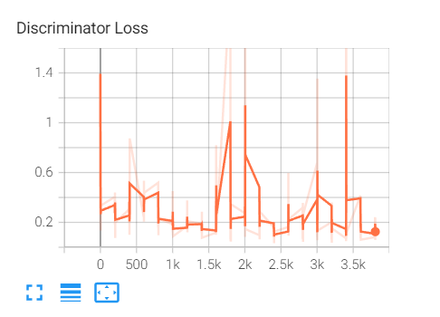

# DCGAN

论文地址：[ Unsupervised Representation Learning with Deep Convolutional Generative Adversarial Networks](https://arxiv.org/abs/1511.06434)

论文中Generator的结构图：


### 1. 训练细节
#### (1) Discriminator

关于判断器的的反向传播，我在注释中写了三种备选方案。

```这三种方案都是有效的，但是有的会增加计算量！！！```

```python
# --------------------------------------------------------------- #
# method 1:
#   disc_loss.backward(retain_graph=True)
#   gen_loss.backward()
# ================================================================ #
# method 2: (这种方式会增加计算量)
#   disc_loss.backward()
#   gen_loss.backward()
# ================================================================ #
# method 3:
#   for param in generator.parameters():
#       param.requires_grad = False
#   for param in discriminator.parameters():
#       param.requires_grad = True
#   disc_loss.backward()
#
#   for param in generator.parameters():
#       param.requires_grad = True
#   for param in discriminator.parameters():
#       param.requires_grad = False
#   gen_loss.backward()
# --------------------------------------------------------------- #
```

**在本代码中，主要采用了下面所示方法：**

```python
# ----------------------------------------------------- #
# 这里采用 .detach() 方法 中断反向传播过程
# ----------------------------------------------------- #
d_fake = discriminator(fake_img.detach()).reshape(-1)
......
disc_optim.zero_grad()
d_fake_loss.backward()
disc_optim.step()          
.......
gen_optim.zero_grad()
g_loss.backward()
gen_optim.step()
```

------

#### (2) Discriminator 和 Generator 交替训练

```a. 先训练 Discriminator：训练时用的数据是等量的真实数据和噪声数据 ,  但是要分开喂给网络，然后进行 back propagation。```

```python
# 用真实图像进行训练
d_real = discriminator(data).reshape(-1)
d_real_loss = criterion(d_real, torch.ones_like(d_real))
disc_optim.zero_grad()
d_real_loss.backward()
disc_optim.step()

# 用噪声进行训练
fake_img = generator(noise)
d_fake = discriminator(fake_img.detach()).reshape(-1)
d_fake_loss = criterion(d_fake, torch.zeros_like(d_fake))
disc_optim.zero_grad()
d_fake_loss.backward()
disc_optim.step()

# ------------------------------------------------------------------ #
# 下述方式也是可行的
# ------------------------------------------------------------------ #
# fake_img = generator(noise)
# d_fake = discriminator(fake_img.detach()).reshape(-1)
# d_real = discriminator(data).reshape(-1)
#
# disc_fake_loss = criterion(d_fake, torch.zeros_like(d_fake))
# disc_real_loss = criterion(d_real, torch.ones_like(d_real))
# disc_loss = (disc_fake_loss + disc_real_loss) / 2
# # 反向传播
# disc_optim.zero_grad()
# disc_loss.backward()
# disc_optim.step()
```

```b. 再训练 Generator```

```python
# --------------------------------------------------------------- #
# (2) 训练生成器: maximize log(D(G(z)))
# --------------------------------------------------------------- #
output = discriminator(fake_img).reshape(-1)
g_loss = criterion(output, torch.ones_like(output))
# 反向传播
gen_optim.zero_grad()
g_loss.backward()
gen_optim.step()
```

-------


### 2. 可视化训练过程

```下面所示的结果都是训练 20 epoch产生的结果（结果仅供参考）```

#### (1). Discriminator 损失曲线



#### (2). Generator 损失曲线


#### (3). 可视化生成结果```


动态演示：


##### 结果很不清晰的原因分析：

a. 训练的epoch不足。

b. 反向传播的损失计算方式不对。

c. Discriminator 和 Generator的学习率，以及交替训练的方式的问题。

d. 训练数据集的质量不佳。


### 3. 相关文件

##### a. 数据集：Link: https://pan.baidu.com/s/1JW6cJIexbAMvgOnrpIcSqQ   pw: 4rxf 

##### b. 权重：Link: https://pan.baidu.com/s/1x9ihvS-xyglGK8HyqtGrbA         pw: gw3i 


# 待补充 。。。。。。。

